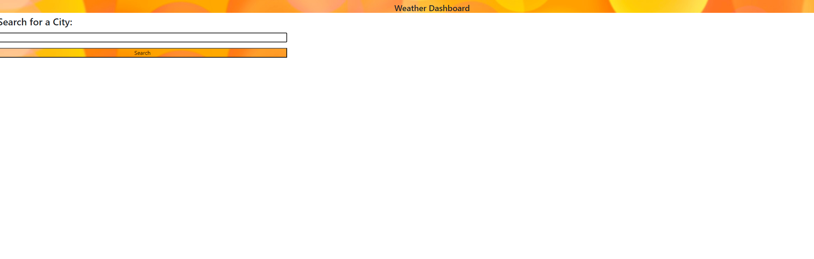
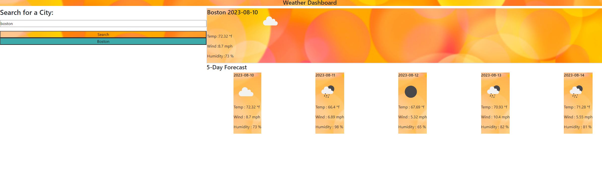

# Weather-forecast

link to live site : https://jbird11801.github.io/Weather-forecast/

## Description

I made this program with the intention of adding it to my digitl portfolio. I enjoyed puuting all of what ive learned into this project and learning more. I couldent do the full five day forcast like in the. \assets\Refrence\Assets\06-server-side-apis-homework-demo.png as the max call of data I can do is 40, and each point is in 3 hour intevals so that means thats 8 poins per for 5 days. One day is the current day that leaves 4 future days. I did do the future forecast with five days to prove I could do it but one is a duplicate of todays forcast.

## Usage

Simply input the name of your city and hit the search button to see the weather for the next five days 

The results are desplayed and cover the next few days. the past searches will also show up and can be clicked on to show the weather. for that location.

## Credits

Used to make the read me file https://courses.bootcampspot.com/courses/3906/pages/3-dot-5-3-create-a-professional-project-readme?module_item_id=885925

used to help with bootstrap syntax https://getbootstrap.com/docs/5.1/components/progress/#height

used to hide and show elements useing jqury https://stackoverflow.com/questions/3582619/how-can-i-change-css-display-none-or-block-property-using-jquery

I learned about breaks in highschool but i read up on them here https://www.w3schools.com/js/js_break.asp

open weather api https://openweathermap.org/forecast5

geocodeing api https://openweathermap.org/api/geocoding-api

jqury api Documentation https://api.jquery.com/jQuery

## License

Please refrence license file